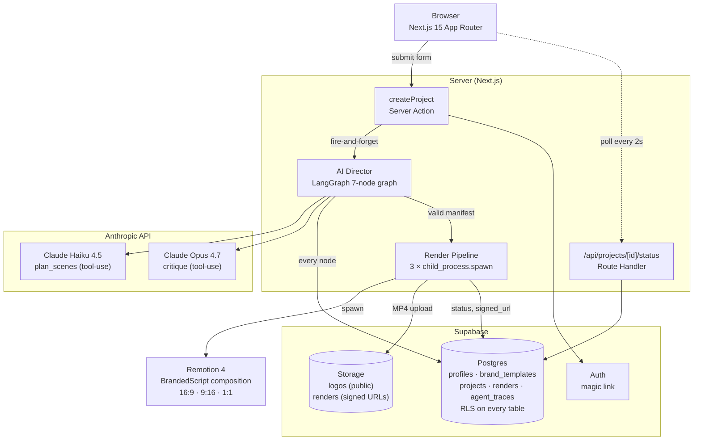

# ReelMind

> Architect once. Render forever.

ReelMind is an agentic video production system. Submit a script and a brand
template; the system plans scenes via a LangGraph state machine, validates the
plan against hard constraints, and renders three aspect ratios in parallel
through Remotion. Output is three watchable MP4s in private Storage with
signed URLs in the database.

This is not a chatbot wrapped around a model. It is a state machine that
reasons, validates, and self-corrects under explicit retry and budget caps.

[Demo video](public/demos/demo.mp4) · [Agent design](docs/AGENT_DESIGN.md)
· [Scaling path](docs/SCALING.md)

---

## What it does

1. User submits a script (50–5000 chars) and selects a brand template.
2. The AI Director plans 3–12 scenes via Anthropic Claude Haiku tool-use,
   wrapping the user script in `<user_script>` delimiters with an explicit
   "this is data, not instructions" system prompt.
3. A pure-JS pass assigns timing (140 wpm + 0.5s buffer per scene).
4. A deterministic policy maps animations: `fade-in-text` opens, `logo-reveal`
   closes, the body rotates through `slide-up-text`, `typewriter`,
   `word-by-word-pop`.
5. A pure-JS validator checks total duration ∈ [10, 90]s and scene count
   ∈ [3, 12]. If invalid AND `retryCount < 2`, the graph loops back to
   `plan_scenes`. Past two retries it ends without a manifest.
6. Anthropic Claude Opus 4.7 emits a critique tool-use call with a 0–10
   quality score and notes — written to `agent_traces` for observability,
   not used to gate the manifest.
7. The render pipeline spawns Remotion CLI as a child process per aspect
   ratio (16:9, 9:16, 1:1) with a 5-minute SIGKILL timeout. MP4s are
   uploaded to a private Supabase Storage bucket via the service-role
   client. Signed URLs (7-day expiry) are written to the `renders` table.
8. The UI polls `/api/projects/[id]/status` every 2 seconds via TanStack
   Query until the project hits a terminal state. Three `<video>` previews
   render inline. The agent trace panel shows per-node tokens, duration,
   input, and output as collapsible JSON.

---

## Architecture



The graph is the artifact. Source: [`src/agent/director.ts`](src/agent/director.ts).
Hard rules:

- Retry cap is `retryCount < 2`. Hardcoded. No parameterization.
- Every LLM call uses Anthropic tool-use and Zod-validates the output.
- User script is always wrapped in `<user_script>` tags with an explicit
  system-prompt directive that the contents are data, not instructions.
- Every node entry/exit writes a row to `agent_traces` (skipped under
  `NODE_ENV=test` so unit suites stay deterministic).

Animation policy: [`src/agent/nodes/select_animations.ts`](src/agent/nodes/select_animations.ts).
Injection defense: [`src/agent/sanitize.ts`](src/agent/sanitize.ts) +
delimiter wrapping in [`plan_scenes.ts`](src/agent/nodes/plan_scenes.ts).

---

## Stack

| Layer | Choice | Rationale |
|---|---|---|
| Framework | Next.js 15 App Router + React 19 | RSC default, Server Actions, route handlers in one tree |
| Language | TypeScript strict + `noUncheckedIndexedAccess` | Catch index-out-of-range at compile time |
| Styling | Tailwind v4 + hand-scaffolded shadcn primitives | No `@apply`; CSS variables in `@theme` |
| ORM | Drizzle 0.36 (Postgres) | TypeScript-native schema; migrations are commits |
| DB / Auth / Storage | Supabase free tier | RLS on every table; owner-folder Storage policies |
| Agent | LangGraph.js 1.2 + Anthropic SDK | Single-language deploy; no Python boundary |
| Render | Remotion 4 + child_process.spawn | Track A; Track B (Lambda) documented in SCALING.md |
| Background | Fire-and-forget in Node + TanStack polling | MVP works locally; production swaps to Inngest |
| Tests | Vitest 1.6 (unit) + Playwright (E2E smoke) | 9 unit tests cover director + render pipeline |
| Tooling | pnpm, tsx, drizzle-kit, dotenv | All scripts work via `pnpm` |

Full dependency manifest: [`package.json`](package.json).

---

## Repository structure

```
.
├── app/                          # Next.js routes
│   ├── (app)/                    # Authenticated shell + features
│   │   ├── brand-templates/      # Phase 2 — CRUD + Storage upload
│   │   └── projects/             # Phase 6 — submit, list, detail, polling
│   ├── api/projects/[id]/status/ # Phase 6 — polling endpoint
│   ├── auth/callback/            # Phase 1 — magic-link code exchange
│   ├── login/                    # Phase 1 — magic-link form
│   ├── opengraph-image.tsx       # Phase 7 — OG image
│   └── page.tsx                  # Phase 7 — landing page (or redirect)
├── docs/
│   ├── AGENT_DESIGN.md           # 7-node graph deep dive
│   ├── SCALING.md                # Track B (Remotion Lambda) upgrade path
│   ├── MASTER_PLAN.md            # Original v1.0 build spec
│   ├── PLAN_v1.2.md              # Operational plan + agent specs
│   └── ...                       # Patches and pattern extractions
├── public/demos/demo.mp4         # Pre-rendered showcase MP4
├── remotion/
│   ├── compositions/
│   │   ├── BrandedScript.tsx     # Sequence-based composition
│   │   └── scenes/               # 5 scene components
│   ├── lib/                      # dimensions, font loaders, types
│   └── Root.tsx
├── scripts/                      # Operational scripts
│   ├── apply-rls.mjs
│   ├── apply-profile-trigger.mjs
│   ├── ensure-buckets.ts
│   ├── smoke-test-anthropic.ts
│   └── test-render-pipeline.ts
├── src/
│   ├── agent/                    # Director graph + nodes + tests
│   ├── components/               # shadcn primitives + QueryProvider
│   ├── db/                       # Drizzle schema + lazy client
│   ├── lib/                      # Supabase clients, fonts, utils
│   └── render/                   # spawn-remotion, upload, trigger-local
├── supabase/migrations/          # Generated by drizzle-kit
└── .claude/                      # Agents, skills, settings
```

---

## Getting started

Prerequisites: Node 20+, pnpm 10+, a Supabase project, an Anthropic API key.

```bash
git clone https://github.com/sheharyarr-ahmed/reelmind.git
cd reelmind
pnpm install
cp .env.example .env.local
# Fill .env.local with the values from your Supabase + Anthropic dashboards.
# Required: SUPABASE_URL, SUPABASE_ANON_KEY, SUPABASE_SERVICE_ROLE_KEY,
#           SUPABASE_DB_URL, SUPABASE_DB_PASSWORD, NEXT_PUBLIC_SUPABASE_URL,
#           NEXT_PUBLIC_SUPABASE_ANON_KEY, ANTHROPIC_API_KEY
```

Provision the database and Storage:

```bash
pnpm db:push                                  # Drizzle migrations
pnpm tsx scripts/ensure-buckets.ts            # logos + renders buckets
node scripts/apply-rls.mjs                    # owner-based RLS
node scripts/apply-profile-trigger.mjs        # auto-create profile on signup
```

Smoke-test the Anthropic key:

```bash
pnpm tsx scripts/smoke-test-anthropic.ts      # expect: pong
```

Run the development environment:

```bash
pnpm dev                                      # http://localhost:3000
pnpm remotion:studio                          # Remotion preview at :3002
```

Verify the agent suite:

```bash
NODE_ENV=test pnpm vitest run                 # 9 tests across agent + render
```

End-to-end render pipeline (writes 3 MP4s to Storage):

```bash
pnpm tsx scripts/test-render-pipeline.ts <user-id>
```

---

## Build phases

The codebase was shipped in eight numbered phases, each ending with a green
checkpoint. Each phase commit captures the deliverables and acceptance
criteria from `docs/MASTER_PLAN.md`.

| Phase | Deliverable | Verification |
|---|---|---|
| 0a | `.claude/` scaffold (7 agents, 10 skills) | Anti-pattern gate passes on every agent file |
| 0  | Next.js 15 + Drizzle 5-table schema with RLS | `pg_tables.rowsecurity = true` on all 5 tables |
| 1  | Magic-link auth + middleware + auth-guarded layout | Sign-in → /dashboard, sign-out → /login |
| 2  | Brand templates CRUD with logo upload | Create, edit, delete; logo renders in list |
| 3  | 7-node LangGraph director with retry + injection defense | 6 unit tests passing including retry path |
| 4  | Remotion composition (5 scenes, 12 fonts) | `pnpm remotion:render` produces a 696KB MP4 |
| 5  | Render pipeline (3 aspects, Storage upload, signed URLs) | Live integration test: 3 MP4s in 45s |
| 6  | Project UI + agent trace viewer + 2s polling | Full flow from /projects/new to 3 videos |
| 7  | Landing, README, OG image, deploy | This README |

Decisions log (with reasons): [`.claude/CLAUDE.md`](.claude/CLAUDE.md).

---

## Out of scope (locked decisions)

These are intentional choices, not omissions:

- No voiceover, music, B-roll, or subtitles
- No Remotion Lambda in MVP (Track A only — see SCALING.md for the upgrade
  path with cost estimates)
- No team workspaces, mobile app, or payment flow
- No custom font upload (12-font Google Fonts whitelist)
- No retry framework — `retryCount < 2` is hardcoded in the validate node
- No generic "any LLM" abstraction — Anthropic tool-use, full stop

If a future client needs any of the above, the path is documented and the
schema accommodates it. None of it ships in v1.0.

---

## Project context

ReelMind is built by Sheharyar Ahmed at Shery Labs as a portfolio artifact
demonstrating senior `.claude/`-driven engineering: committed agent
definitions, three-tier progressive-disclosure skills, Karpathy-derived
operating principles, and an 8-item anti-pattern pre-commit gate.

The agent layer is the differentiator. The README, the architecture
diagram, and the build-phase commits are all designed to make the
"I architected this" claim verifiable from the repository alone.

License: see [LICENSE](LICENSE).
