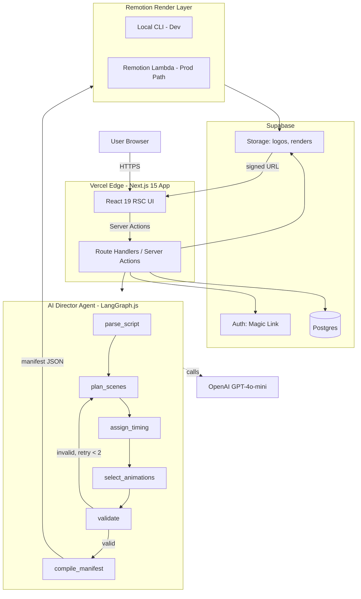

# REELMIND — MASTER BUILD PLAN

**Project Codename (chat):** PROJECT TASKFLOW
**Product Name:** ReelMind
**Owner:** Sheharyar Ahmed (Shery Labs)
**Plan Version:** 1.0
**Target Format:** Claude Code Plan Mode + Cline Compatible
**Target Timeline:** 16–24 hour weekend sprint (AI-assisted) | 40–50 hours unassisted
**Strategic Anchor:** Closes the AI Video / Marketing Engineering job-class gap identified in `project-ideas.md` § Project 1.

---

## 0. EXECUTIVE SUMMARY

### 0.1 What We Are Building

ReelMind is an **agentic video production system** that converts a written script and a brand template into broadcast-ready, multi-aspect-ratio video deliverables (16:9, 9:16, 1:1) — without a human editor in the loop.

It is not "another AI video tool." It is the **orchestration layer** marketing agencies are missing: the system that connects script sources, brand systems, scene logic, and programmatic rendering into one autonomous pipeline.

### 0.2 The Strategic Hook (Portfolio README + Pitch Use)

> "Uses a React-based programmatic video rendering pipeline (Remotion) orchestrated by a LangGraph agent that decomposes scripts, plans timing, validates coherence, and self-corrects — producing brand-consistent multi-aspect-ratio videos from a single script source. No human editor required."

### 0.3 Job-Pipeline Targeting

This portfolio asset is engineered to convert these specific job categories already visible in your Upwork pipeline:

| Job Class | Example Job | Relevance |
|-----------|-------------|-----------|
| AI Video Engineer | HeyGen Hyperframes, $354K client | Direct match — script→render automation |
| Content Machine | Israel agency, $67K client | Direct match — programmatic video ops |
| Remotion Specialist | Hong Kong, Claude Code + Remotion | Direct match — exact stack |
| Marketing Engineering | Generic AI content pipelines | Demonstrates agentic content infra |

### 0.4 Success Criteria

A built ReelMind succeeds if **all six** are true:

1. Live deployed URL where a stranger can run the full flow end-to-end.
2. Source code public on GitHub with a README that reads like a senior architecture doc.
3. Demo video (60–90 seconds) showing script → rendered output.
4. Architecture diagram (Mermaid) committed to the repo.
5. At least one rendered output per aspect ratio shipped to `/public/demos/`.
6. Agent observability — visible logs of the AI Director's decisions per render.

---

## 1. PRODUCT SPECIFICATION

### 1.1 Primary User Journey (MVP)

```
1. User signs up (email + magic link, Supabase auth)
2. User creates a Brand Template:
   - Brand name
   - Primary color (hex)
   - Secondary color (hex)
   - Accent color (hex)
   - Logo upload (PNG/SVG)
   - Heading font (Google Fonts dropdown)
   - Body font (Google Fonts dropdown)
3. User starts a new Project:
   - Names the project
   - Selects a brand template
   - Pastes a script (max 1500 chars MVP)
   - Picks target aspect ratios (multi-select: 16:9, 9:16, 1:1)
4. User clicks "Generate"
5. System runs the AI Director Agent:
   - Decomposes script into scenes
   - Plans timing
   - Selects animations
   - Validates output
   - Emits render manifest
6. System renders each requested aspect ratio
7. User sees:
   - Render progress (live status from agent)
   - Final video preview(s) in browser
   - Download button per variant
   - "Agent Trace" — collapsible log of decisions made
```

### 1.2 Feature Set — MVP (must ship)

- Email auth (Supabase magic link)
- Brand template CRUD (create, list, edit, delete)
- Logo upload to Supabase Storage
- Project creation with script input
- AI Director Agent (LangGraph.js) with 6 nodes
- Remotion video composition (one base composition, parameterized)
- Three aspect ratio outputs (16:9, 9:16, 1:1)
- Local render trigger (dev) / Lambda render trigger (prod path documented)
- Per-render agent trace visible in UI
- Video download (MP4)
- Render history per user

### 1.3 Stretch Features — Phase 7+ (do NOT ship in weekend sprint)

- Voiceover via ElevenLabs API
- Background music selection
- Stock B-roll integration
- Team workspaces / multi-user brand templates
- MCP server exposing ReelMind as a tool for Claude Desktop / Cursor
- Subtitles auto-generation
- A/B variant generation per scene
- Webhook for render-complete (so other agents can chain)

### 1.4 Explicit Out-of-Scope

These are **deliberately cut** to protect the timeline. Listed so Claude Code does not attempt them:

- Video editing UI (timeline scrubber, clip trimming)
- Real-time collaborative editing
- Mobile app (this is web-only)
- Custom font upload (Google Fonts only in MVP)
- Multi-language script translation
- Payment / billing system
- Analytics dashboard

---

## 2. SYSTEM ARCHITECTURE

### 2.1 High-Level Component Diagram



### 2.2 The Agentic Core — AI Director Agent

This is the differentiator. Not a chatbot. A state machine that **reasons, validates, and self-corrects**.

**Framework:** LangGraph.js (`@langchain/langgraph`)
**Why LangGraph.js (not Python):** Keeps the entire app in TypeScript, runs inside Next.js Route Handlers, zero cross-language deployment friction. The Python pillar of Shery Labs remains for projects where Python's ML ecosystem is mandatory — not here.

**State Schema:**

```typescript
type DirectorState = {
  // Inputs
  script: string;
  brandTemplate: BrandTemplate;
  targetDurationSeconds?: number;

  // Working memory
  cleanedScript: string;
  scenes: Scene[];
  totalDuration: number;

  // Control
  retryCount: number;
  errors: AgentError[];

  // Output
  manifest: VideoManifest | null;
};

type Scene = {
  index: number;
  text: string;
  durationSeconds: number;
  animation: AnimationType;
  emphasisColor: 'primary' | 'secondary' | 'accent';
  startAt: number;
};

type AnimationType =
  | 'fade-in-text'
  | 'slide-up-text'
  | 'typewriter'
  | 'word-by-word-pop'
  | 'logo-reveal';
```

**Nodes:**

| Node | Responsibility | LLM Call? |
|------|----------------|-----------|
| `parse_script` | Strip whitespace, normalize punctuation, detect script length class | No (pure JS) |
| `plan_scenes` | Decide scene count + per-scene text via GPT-4o-mini structured output | Yes |
| `assign_timing` | Calculate duration per scene (140 wpm reading speed + buffer) | No |
| `select_animations` | Map scenes to animations using a deterministic policy + LLM tiebreak | Optional |
| `validate` | Check total duration, scene coherence, brand fit | No |
| `compile_manifest` | Emit final `VideoManifest` JSON for Remotion | No |

**Edges (Conditional):**

- `validate` → `compile_manifest` if all checks pass
- `validate` → `plan_scenes` if checks fail AND `retryCount < 2`
- `validate` → END (with error) if `retryCount >= 2`

**Why this matters for positioning:** When a prospect reads the README, they see a real agent — not a chatbot wrapper. This is the proof artifact for the "agents that execute, not chatbots" hook.

### 2.3 Rendering Strategy — Dual Track

Remotion renders are CPU-intensive and exceed Vercel serverless limits (10s default, 60s max on Pro, plus memory caps). Two-track strategy:

**Track A — Development & Demo (week 1):**
- Run Remotion via local CLI (`npx remotion render`)
- Triggered from a Node.js child process spawned by a Next.js Route Handler in `dev` mode only
- Suitable for the demo video, screen recordings, and personal use
- Output written to local disk, then uploaded to Supabase Storage

**Track B — Production Path (documented, optional build):**
- Remotion Lambda (`@remotion/lambda`)
- Deploy a render Lambda to AWS once
- Next.js triggers `renderMediaOnLambda()` from a Server Action
- Lambda writes MP4 to S3, returns signed URL
- Cost: ~$0.0033 per 30-second 1080p render

**Decision rule:** Ship Track A for the weekend. Document Track B in `docs/SCALING.md` as the "here is how this scales to 1000 renders/day" story for prospects. **Do not build Track B unless a paying client needs it.**

### 2.4 Data Flow — End to End

```
1. POST /api/projects (Server Action)
   → validate input (Zod)
   → insert project row (status: 'queued')
   → return projectId

2. POST /api/projects/{id}/generate (Server Action)
   → fetch project + brand template
   → invoke AIDirectorAgent.invoke({ script, brandTemplate })
   → store manifest in `renders` table
   → trigger render(s) per requested aspect ratio
   → update render row status: 'rendering' → 'complete' | 'failed'
   → write MP4 to Supabase Storage
   → store signed URL in render row

3. GET /api/projects/{id}/status (polling)
   → returns project + all renders + agent trace
```

---

## 3. COMPLETE TECH STACK

Every choice below is deliberate. Junior engineers default to "what they know." Senior engineers pick stack to match constraints.

### 3.1 Frontend

| Layer | Choice | Rationale |
|-------|--------|-----------|
| Framework | Next.js 15 (App Router, RSC) | 2026 standard, Server Actions remove API boilerplate |
| Runtime | React 19 | Concurrent features, `use()` hook for promises |
| Language | TypeScript 5.7+ (strict) | Type safety = senior signal |
| Styling | Tailwind CSS v4 | Zero-config, modern engine |
| Component Library | shadcn/ui | Copy-paste primitives, full ownership |
| Forms | React Hook Form + Zod | Industry standard combo |
| Client State | TanStack Query v5 | For polling render status |
| Animation | Framer Motion | UI animations (separate from Remotion video animations) |
| Icons | Lucide React | Lightweight, consistent |

### 3.2 Backend / API

| Layer | Choice | Rationale |
|-------|--------|-----------|
| API Style | Next.js Server Actions + Route Handlers | RPC-style for forms, REST handlers for polling |
| Validation | Zod | Single source of truth for types + runtime checks |
| ORM | Drizzle ORM | Type-safe, SQL-first, faster than Prisma in 2026 |
| Database Driver | `postgres.js` (via Drizzle) | Native Postgres, no Prisma engine overhead |

### 3.3 Database & Storage

| Layer | Choice | Rationale |
|-------|--------|-----------|
| Database | Supabase Postgres | Free tier, RLS built-in, managed |
| Auth | Supabase Auth (magic link) | No password management overhead |
| File Storage | Supabase Storage | Logos + rendered MP4s |
| Schema Migrations | Drizzle Kit | `drizzle-kit generate` + `drizzle-kit push` |

### 3.4 AI / Agentic

| Layer | Choice | Rationale |
|-------|--------|-----------|
| Agent Framework | LangGraph.js (`@langchain/langgraph`) | State machine semantics, retry logic native |
| LLM Provider | OpenAI `gpt-4o-mini` | Cheap, fast, structured-output reliable |
| Structured Output | OpenAI function calling + Zod schemas | Type-safe LLM responses |
| Observability | Manual trace logger → Postgres `agent_traces` table | LangSmith optional Phase 7 |

### 3.5 Video Rendering

| Layer | Choice | Rationale |
|-------|--------|-----------|
| Engine | Remotion 4.x | React-based, programmatic, brand-template friendly |
| Composition | TSX components in `/remotion/` | Same React patterns as the app UI |
| Render (dev) | Remotion CLI via `child_process.spawn` | Zero infra |
| Render (prod path) | Remotion Lambda + AWS S3 | Documented, not built in MVP |
| Output Format | MP4 (H.264, 30fps, 1080p) | Universal compatibility |

### 3.6 Deployment & Infra

| Layer | Choice | Rationale |
|-------|--------|-----------|
| Hosting | Vercel | Native Next.js, zero config |
| DNS | Vercel-managed | `reelmind.vercel.app` MVP, custom domain Phase 7 |
| Secrets | Vercel Environment Variables | Per-environment scoping |
| CI/CD | GitHub Actions + Vercel auto-deploy | Lint + typecheck + test on PR |

### 3.7 Dev Tooling

| Layer | Choice | Rationale |
|-------|--------|-----------|
| Package Manager | pnpm | Fast, disk-efficient |
| Linter | ESLint 9 (flat config) + `eslint-config-next` | Standard |
| Formatter | Prettier 3 + `prettier-plugin-tailwindcss` | Class sorting |
| Git Hooks | Husky + lint-staged | Pre-commit gate |
| Type Check | `tsc --noEmit` in CI | Catch drift |
| Editor | VS Code + Claude Code/Cline (per your environment) | Native flow |

### 3.8 Testing

| Layer | Choice | Rationale |
|-------|--------|-----------|
| Unit | Vitest | Fast, ESM-native |
| Component | Vitest + Testing Library | UI sanity |
| Agent | Vitest with mocked OpenAI | Snapshot-test agent state transitions |
| E2E | Playwright (1 happy-path test) | Senior signal in README |

### 3.9 Complete Dependency Manifest

```json
{
  "dependencies": {
    "next": "^15.1.0",
    "react": "^19.0.0",
    "react-dom": "^19.0.0",
    "@supabase/ssr": "^0.5.0",
    "@supabase/supabase-js": "^2.45.0",
    "drizzle-orm": "^0.36.0",
    "postgres": "^3.4.0",
    "@langchain/langgraph": "^0.2.0",
    "@langchain/openai": "^0.3.0",
    "@langchain/core": "^0.3.0",
    "openai": "^4.70.0",
    "zod": "^3.23.0",
    "remotion": "^4.0.250",
    "@remotion/cli": "^4.0.250",
    "@remotion/bundler": "^4.0.250",
    "@remotion/renderer": "^4.0.250",
    "@remotion/lambda": "^4.0.250",
    "react-hook-form": "^7.53.0",
    "@hookform/resolvers": "^3.9.0",
    "@tanstack/react-query": "^5.59.0",
    "framer-motion": "^11.11.0",
    "lucide-react": "^0.460.0",
    "tailwindcss": "^4.0.0",
    "class-variance-authority": "^0.7.0",
    "clsx": "^2.1.0",
    "tailwind-merge": "^2.5.0"
  },
  "devDependencies": {
    "@types/node": "^22.0.0",
    "@types/react": "^19.0.0",
    "typescript": "^5.7.0",
    "drizzle-kit": "^0.28.0",
    "vitest": "^2.1.0",
    "@testing-library/react": "^16.0.0",
    "@playwright/test": "^1.48.0",
    "eslint": "^9.13.0",
    "eslint-config-next": "^15.1.0",
    "prettier": "^3.3.0",
    "prettier-plugin-tailwindcss": "^0.6.0",
    "husky": "^9.1.0",
    "lint-staged": "^15.2.0"
  }
}
```

---

## 4. DATA MODEL

### 4.1 Database Schema (Drizzle / Postgres)

```typescript
// src/db/schema.ts
import {
  pgTable, uuid, text, timestamp, integer, jsonb, boolean
} from 'drizzle-orm/pg-core';

// Users are managed by Supabase auth; we mirror via foreign key
export const profiles = pgTable('profiles', {
  id: uuid('id').primaryKey(), // matches auth.users.id
  email: text('email').notNull(),
  createdAt: timestamp('created_at').defaultNow().notNull(),
});

export const brandTemplates = pgTable('brand_templates', {
  id: uuid('id').defaultRandom().primaryKey(),
  ownerId: uuid('owner_id').references(() => profiles.id).notNull(),
  name: text('name').notNull(),
  primaryColor: text('primary_color').notNull(),    // hex
  secondaryColor: text('secondary_color').notNull(),
  accentColor: text('accent_color').notNull(),
  logoUrl: text('logo_url'),                         // Supabase Storage URL
  headingFont: text('heading_font').notNull().default('Inter'),
  bodyFont: text('body_font').notNull().default('Inter'),
  createdAt: timestamp('created_at').defaultNow().notNull(),
  updatedAt: timestamp('updated_at').defaultNow().notNull(),
});

export const projects = pgTable('projects', {
  id: uuid('id').defaultRandom().primaryKey(),
  ownerId: uuid('owner_id').references(() => profiles.id).notNull(),
  brandTemplateId: uuid('brand_template_id').references(() => brandTemplates.id).notNull(),
  name: text('name').notNull(),
  script: text('script').notNull(),
  status: text('status', {
    enum: ['draft', 'agent_running', 'rendering', 'complete', 'failed']
  }).notNull().default('draft'),
  manifest: jsonb('manifest'),  // VideoManifest produced by agent
  createdAt: timestamp('created_at').defaultNow().notNull(),
});

export const renders = pgTable('renders', {
  id: uuid('id').defaultRandom().primaryKey(),
  projectId: uuid('project_id').references(() => projects.id).notNull(),
  aspectRatio: text('aspect_ratio', {
    enum: ['16:9', '9:16', '1:1']
  }).notNull(),
  status: text('status', {
    enum: ['queued', 'rendering', 'complete', 'failed']
  }).notNull().default('queued'),
  outputUrl: text('output_url'),  // Supabase Storage URL
  durationSeconds: integer('duration_seconds'),
  errorMessage: text('error_message'),
  startedAt: timestamp('started_at'),
  completedAt: timestamp('completed_at'),
  createdAt: timestamp('created_at').defaultNow().notNull(),
});

export const agentTraces = pgTable('agent_traces', {
  id: uuid('id').defaultRandom().primaryKey(),
  projectId: uuid('project_id').references(() => projects.id).notNull(),
  nodeName: text('node_name').notNull(),
  inputState: jsonb('input_state').notNull(),
  outputState: jsonb('output_state').notNull(),
  durationMs: integer('duration_ms').notNull(),
  llmCall: boolean('llm_call').notNull().default(false),
  tokensUsed: integer('tokens_used'),
  createdAt: timestamp('created_at').defaultNow().notNull(),
});
```

### 4.2 Supabase RLS Policies (must apply)

```sql
-- profiles: user can read/update own row only
CREATE POLICY "own profile read" ON profiles
  FOR SELECT USING (auth.uid() = id);

-- brand_templates: owner-only CRUD
CREATE POLICY "own brand templates" ON brand_templates
  FOR ALL USING (auth.uid() = owner_id);

-- projects: owner-only CRUD
CREATE POLICY "own projects" ON projects
  FOR ALL USING (auth.uid() = owner_id);

-- renders: visible if parent project is owned
CREATE POLICY "renders via project" ON renders
  FOR ALL USING (
    EXISTS (SELECT 1 FROM projects WHERE projects.id = renders.project_id AND projects.owner_id = auth.uid())
  );

-- agent_traces: same as renders
CREATE POLICY "traces via project" ON agent_traces
  FOR SELECT USING (
    EXISTS (SELECT 1 FROM projects WHERE projects.id = agent_traces.project_id AND projects.owner_id = auth.uid())
  );

ALTER TABLE profiles ENABLE ROW LEVEL SECURITY;
ALTER TABLE brand_templates ENABLE ROW LEVEL SECURITY;
ALTER TABLE projects ENABLE ROW LEVEL SECURITY;
ALTER TABLE renders ENABLE ROW LEVEL SECURITY;
ALTER TABLE agent_traces ENABLE ROW LEVEL SECURITY;
```

### 4.3 Supabase Storage Buckets

| Bucket | Public | Use |
|--------|--------|-----|
| `logos` | yes (read) | Brand template logos |
| `renders` | no (signed URLs only) | Output MP4s |

---

## 5. API SURFACE

### 5.1 Server Actions (preferred)

```typescript
// src/app/actions/brand-templates.ts
'use server';
export async function createBrandTemplate(input: CreateBrandTemplateInput): Promise<BrandTemplate>
export async function updateBrandTemplate(id: string, input: UpdateBrandTemplateInput): Promise<BrandTemplate>
export async function deleteBrandTemplate(id: string): Promise<void>
export async function uploadLogo(formData: FormData): Promise<{ url: string }>

// src/app/actions/projects.ts
'use server';
export async function createProject(input: CreateProjectInput): Promise<{ id: string }>
export async function generateProject(projectId: string): Promise<void>  // fire-and-forget, kicks off agent + render
```

### 5.2 Route Handlers (for polling + streaming)

```typescript
// src/app/api/projects/[id]/status/route.ts
GET → returns { project, renders[], traces[] }

// src/app/api/projects/[id]/stream/route.ts (stretch, Phase 7)
GET → SSE stream of agent + render events
```

### 5.3 External Integrations

| Service | Auth | Purpose |
|---------|------|---------|
| OpenAI API | `OPENAI_API_KEY` | Agent LLM calls |
| Supabase | URL + anon + service role keys | DB, Auth, Storage |
| AWS (Phase 7 prod render) | IAM credentials | Remotion Lambda |

---

## 6. REPOSITORY STRUCTURE

```
reelmind/
├── .github/
│   └── workflows/
│       └── ci.yml                    # lint + typecheck + test
├── docs/
│   ├── ARCHITECTURE.md               # this plan, condensed
│   ├── SCALING.md                    # Remotion Lambda path
│   └── AGENT_DESIGN.md               # AI Director deep dive
├── public/
│   └── demos/                        # pre-rendered showcase MP4s
├── remotion/
│   ├── Root.tsx                      # Remotion composition registry
│   ├── compositions/
│   │   ├── BrandedScript.tsx         # parameterized composition
│   │   └── scenes/
│   │       ├── FadeInText.tsx
│   │       ├── SlideUpText.tsx
│   │       ├── Typewriter.tsx
│   │       ├── WordByWordPop.tsx
│   │       └── LogoReveal.tsx
│   └── lib/
│       ├── manifest-types.ts
│       └── animation-policy.ts
├── src/
│   ├── app/
│   │   ├── (marketing)/
│   │   │   └── page.tsx              # landing
│   │   ├── (auth)/
│   │   │   ├── login/page.tsx
│   │   │   └── callback/route.ts
│   │   ├── (app)/
│   │   │   ├── layout.tsx            # authed shell
│   │   │   ├── dashboard/page.tsx
│   │   │   ├── brand-templates/
│   │   │   │   ├── page.tsx          # list
│   │   │   │   ├── new/page.tsx
│   │   │   │   └── [id]/edit/page.tsx
│   │   │   └── projects/
│   │   │       ├── page.tsx          # list
│   │   │       ├── new/page.tsx
│   │   │       └── [id]/page.tsx     # detail + status + downloads
│   │   ├── actions/
│   │   │   ├── brand-templates.ts
│   │   │   └── projects.ts
│   │   ├── api/
│   │   │   └── projects/
│   │   │       └── [id]/
│   │   │           └── status/route.ts
│   │   ├── layout.tsx
│   │   └── globals.css
│   ├── agent/
│   │   ├── director.ts               # LangGraph graph definition
│   │   ├── nodes/
│   │   │   ├── parse-script.ts
│   │   │   ├── plan-scenes.ts
│   │   │   ├── assign-timing.ts
│   │   │   ├── select-animations.ts
│   │   │   ├── validate.ts
│   │   │   └── compile-manifest.ts
│   │   ├── schemas.ts                # Zod schemas for state + LLM output
│   │   ├── trace-logger.ts           # writes to agent_traces table
│   │   └── __tests__/
│   │       └── director.test.ts
│   ├── render/
│   │   ├── trigger-local.ts          # spawn remotion CLI
│   │   ├── trigger-lambda.ts         # stub for Phase 7
│   │   └── upload-to-storage.ts
│   ├── db/
│   │   ├── schema.ts
│   │   ├── client.ts                 # Drizzle client
│   │   └── migrations/               # generated by drizzle-kit
│   ├── lib/
│   │   ├── supabase/
│   │   │   ├── client.ts             # browser
│   │   │   ├── server.ts             # server components
│   │   │   └── middleware.ts         # session refresh
│   │   ├── utils.ts
│   │   └── google-fonts.ts           # whitelist
│   ├── components/
│   │   ├── ui/                       # shadcn primitives
│   │   ├── brand-template-form.tsx
│   │   ├── project-form.tsx
│   │   ├── agent-trace-viewer.tsx
│   │   ├── render-card.tsx
│   │   └── video-preview.tsx
│   └── types/
│       └── index.ts
├── e2e/
│   └── happy-path.spec.ts
├── .env.example
├── .env.local                        # gitignored
├── .eslintrc.json
├── .gitignore
├── .prettierrc
├── drizzle.config.ts
├── next.config.ts
├── package.json
├── pnpm-lock.yaml
├── playwright.config.ts
├── postcss.config.mjs
├── README.md                         # the portfolio doc
├── remotion.config.ts
├── tailwind.config.ts
├── tsconfig.json
└── vitest.config.ts
```

---

## 7. PHASED BUILD PLAN

Each phase is **independently committable** and **independently demoable**. Claude Code should checkpoint between phases.

### Phase 0 — Foundation (1.5 hours)

**Deliverables:**
- Initialize Next.js 15 + TS + Tailwind v4 + ESLint
- Add pnpm, Husky, lint-staged, Prettier
- Create Supabase project, capture URL + keys
- Configure `.env.local` and `.env.example`
- Add Drizzle config + initial schema migration
- Apply RLS policies
- Create Storage buckets
- Initial commit, push to `github.com/sheharyarr-ahmed/reelmind`

**Acceptance:** `pnpm dev` runs, Supabase connection verified by a `select 1` test query.

### Phase 1 — Auth Shell (1.5 hours)

**Deliverables:**
- Supabase magic-link login flow
- `/login` page
- `/auth/callback` route handler
- Authenticated layout `(app)/layout.tsx` with sign-out
- Empty `/dashboard` page behind auth
- Middleware for session refresh
- Profile row auto-created on first login (trigger or server action)

**Acceptance:** Sign in → land on `/dashboard`. Sign out → kick to `/login`.

### Phase 2 — Brand Templates (2.5 hours)

**Deliverables:**
- `/brand-templates` list page (RSC, fetches via Drizzle)
- `/brand-templates/new` form (RHF + Zod + shadcn)
- Color pickers (3 swatches)
- Logo upload to Supabase Storage `logos` bucket
- Google Fonts dropdown (whitelist of 12 fonts)
- Edit + delete actions
- Toast feedback (sonner)

**Acceptance:** User can create, edit, delete a brand template. Logo renders in list.

### Phase 3 — AI Director Agent (4 hours) ⚡ The Crown Jewel

**Deliverables:**
- LangGraph.js graph in `src/agent/director.ts`
- All 6 nodes implemented in `src/agent/nodes/`
- Zod schemas in `src/agent/schemas.ts`
- `parse_script`: pure JS normalization
- `plan_scenes`: GPT-4o-mini structured output, returns `Scene[]` minus timing
- `assign_timing`: 140 wpm formula, adds 0.5s buffer per scene
- `select_animations`: deterministic policy (first scene = `fade-in-text`, last scene = `logo-reveal`, body = rotation of remaining 3)
- `validate`: checks total duration in [10, 90] seconds, scene count in [3, 12]
- Conditional retry edge: validate → plan_scenes if invalid && retryCount < 2
- `compile_manifest`: emits `VideoManifest`
- Trace logger writes to `agent_traces` table on every node entry/exit
- Vitest unit tests with mocked OpenAI calls (3 minimum: happy path, retry path, max-retry-failure path)

**Acceptance:**
```bash
pnpm vitest src/agent
# All green. At least one test asserts retry path executes.
```

### Phase 4 — Remotion Composition (3 hours)

**Deliverables:**
- `remotion/Root.tsx` registers `BrandedScript` composition
- `BrandedScript.tsx` accepts `VideoManifest` props
- 5 scene components (one per `AnimationType`)
- Brand colors + fonts threaded through composition
- Logo reveal scene uses `` from Remotion
- `remotion.config.ts` configured (1080p base, 30fps, H.264)
- `pnpm remotion studio` works locally
- Test render via CLI: `pnpm remotion render BrandedScript out/test.mp4 --props='{...}'`

**Acceptance:** A hand-crafted manifest renders to a watchable MP4 locally.

### Phase 5 — Render Pipeline + Multi-Aspect (3 hours)

**Deliverables:**
- `src/render/trigger-local.ts`: spawns Remotion CLI as child process
- Manifest is JSON-stringified and passed via `--props=` flag
- Render output uploaded to `renders` bucket via service-role client
- Signed URL written to `renders` table
- `BrandedScript` composition supports dynamic dimensions:
  - 16:9 → 1920×1080
  - 9:16 → 1080×1920
  - 1:1 → 1080×1080
- Per-aspect-ratio render row created and tracked
- Status transitions: `queued` → `rendering` → `complete`
- `src/render/trigger-lambda.ts` stubbed with TODO + reference to `docs/SCALING.md`

**Acceptance:** Submitting a project produces 3 MP4s in Storage with signed URLs in DB.

### Phase 6 — Project UI + Agent Trace Viewer (2.5 hours)

**Deliverables:**
- `/projects/new` form (brand template select, script textarea, aspect ratio checkboxes)
- `/projects/[id]` detail page:
  - Status pill (uses TanStack Query polling `/api/projects/[id]/status` every 2s)
  - Three render cards (one per aspect ratio) with inline `<video>` preview
  - Download button per render
  - Collapsible "Agent Trace" panel showing each node's execution, duration, and LLM token usage
- `agent-trace-viewer.tsx`: pretty-prints node inputs/outputs as collapsible JSON
- Empty/loading/error states for every async surface

**Acceptance:** Full flow from `/projects/new` to viewing 3 rendered videos works end-to-end.

### Phase 7 — Polish, Tests, Deploy (2.5 hours)

**Deliverables:**
- Landing page `/` with the hook + 60-second demo video embed + GitHub link
- Pre-rendered demo MP4s committed to `public/demos/`
- 1 Playwright E2E test: sign in → create brand template → create project → poll until complete
- README rewrite (see § 11)
- Mermaid architecture diagram embedded in README
- `docs/AGENT_DESIGN.md` deep dive
- `docs/SCALING.md` Remotion Lambda path
- Vercel deployment with all env vars set
- Custom Open Graph image
- Final commit, tag `v1.0.0`

**Acceptance:** Live URL works for a stranger. README reads like a senior architecture doc.

### Time Budget Summary

| Phase | Hours |
|-------|-------|
| 0. Foundation | 1.5 |
| 1. Auth Shell | 1.5 |
| 2. Brand Templates | 2.5 |
| 3. AI Director Agent | 4.0 |
| 4. Remotion Composition | 3.0 |
| 5. Render Pipeline | 3.0 |
| 6. Project UI | 2.5 |
| 7. Polish + Deploy | 2.5 |
| **Total** | **20.5** |

Aligned to the 16–20 hour weekend sprint estimate in `project-ideas.md` with a small buffer.

---

## 8. ENVIRONMENT & SECRETS

### 8.1 `.env.example`

```bash
# Next.js
NEXT_PUBLIC_APP_URL=http://localhost:3000

# Supabase
NEXT_PUBLIC_SUPABASE_URL=
NEXT_PUBLIC_SUPABASE_ANON_KEY=
SUPABASE_SERVICE_ROLE_KEY=
SUPABASE_DB_URL=postgresql://...

# OpenAI
OPENAI_API_KEY=
OPENAI_MODEL=gpt-4o-mini

# Remotion (Phase 7 prod path only)
REMOTION_AWS_ACCESS_KEY_ID=
REMOTION_AWS_SECRET_ACCESS_KEY=
REMOTION_AWS_REGION=us-east-1
REMOTION_LAMBDA_FUNCTION_NAME=
REMOTION_S3_BUCKET=

# Feature Flags
NEXT_PUBLIC_RENDER_MODE=local  # local | lambda
```

### 8.2 Vercel Environment Variables

All of the above set in Vercel project settings → Environment Variables, scoped to `Production`, `Preview`, `Development` as appropriate.

`SUPABASE_SERVICE_ROLE_KEY` and `OPENAI_API_KEY` must be **server-only** (not prefixed with `NEXT_PUBLIC_`).

---

## 9. DEPLOYMENT

### 9.1 Vercel Setup

```bash
pnpm dlx vercel link
pnpm dlx vercel env pull .env.local
pnpm dlx vercel --prod
```

### 9.2 Build Configuration

```typescript
// next.config.ts
export default {
  experimental: {
    serverActions: { bodySizeLimit: '10mb' }, // for logo uploads
  },
  images: {
    remotePatterns: [
      { protocol: 'https', hostname: '*.supabase.co' },
    ],
  },
};
```

### 9.3 Vercel Caveat — Render Trigger

The local render trigger uses `child_process.spawn`, which **will not work on Vercel serverless**. For the deployed app, the demo flow uses **pre-baked manifests** that map to pre-rendered MP4s in `/public/demos/`. The "live agent + render" path is shown in the local screen recording embedded in the README.

This is the right call for an MVP portfolio piece. Document it honestly in `docs/SCALING.md` with the Remotion Lambda upgrade path. Honesty is a senior signal.

---

## 10. QUALITY GATES

### 10.1 CI Pipeline (`.github/workflows/ci.yml`)

```yaml
name: CI
on: [push, pull_request]
jobs:
  check:
    runs-on: ubuntu-latest
    steps:
      - uses: actions/checkout@v4
      - uses: pnpm/action-setup@v4
        with: { version: 9 }
      - uses: actions/setup-node@v4
        with: { node-version: 22, cache: 'pnpm' }
      - run: pnpm install --frozen-lockfile
      - run: pnpm lint
      - run: pnpm typecheck
      - run: pnpm test
```

### 10.2 Pre-commit Hook (lint-staged)

```json
{
  "*.{ts,tsx}": ["eslint --fix", "prettier --write"],
  "*.{json,md}": ["prettier --write"]
}
```

### 10.3 Type Coverage

- `tsconfig.json` extends with `"strict": true`, `"noUncheckedIndexedAccess": true`
- No `any` allowed except in adapter shim files (with `// eslint-disable` justification)

---

## 11. PORTFOLIO POLISH — README STRUCTURE

The README is the artifact prospects judge. It should read as a **senior architecture document**, not a tutorial.

### 11.1 Section Outline

```markdown
# ReelMind

**Agentic video production. Script in. Branded multi-format video out. No editor in the loop.**

[Live Demo](#) · [Architecture](#architecture) · [Agent Design](docs/AGENT_DESIGN.md) · [Scaling](docs/SCALING.md)

![Hero demo GIF or video embed]

## The Problem
Marketing teams in 2026 have AI video tools (HeyGen, Synthesia, Remotion) and they have script sources (Notion, Google Docs, ChatGPT). They do not have the orchestration layer between them. The result: editors hand-assembling videos that an agent could produce.

## The Approach
ReelMind treats video production as a state-machine problem. A LangGraph agent decomposes a script, plans timing, selects brand-appropriate animations, validates output, and self-corrects on failure. Remotion renders the result programmatically. The output is brand-consistent video in three aspect ratios from a single script.

## Architecture
[Mermaid diagram]

## The Agent — AI Director
Six nodes, conditional retry, full observability. See `docs/AGENT_DESIGN.md`.

| Node | Responsibility | LLM? |
| ... |

## The Stack
Next.js 15 · React 19 · TypeScript · Tailwind v4 · Supabase · Drizzle · LangGraph.js · OpenAI · Remotion 4 · Vercel

## Running Locally
[clone, env, pnpm install, supabase link, drizzle push, remotion studio, pnpm dev]

## Production Path
Local rendering ships in MVP. Production scale path uses Remotion Lambda — documented in `docs/SCALING.md`. 1000 renders/day costs ~$3.30 in compute.

## Author
Sheharyar Ahmed — Founder, [Shery Labs](https://github.com/sheharyarr-ahmed)
Building agentic systems that execute workflows, not dashboards that display them.
[Upwork](https://upwork.com/freelancers/sherylabs) · [LinkedIn](https://linkedin.com/in/sheharyar-ahmed-89598b226)
```

### 11.2 Demo Video (60–90s, embedded at top of README)

Loose script:
1. (0–10s) Land on `/projects/new`. Voice: "ReelMind takes a script and a brand and produces video. Watch."
2. (10–30s) Paste a 3-sentence script. Pick brand template. Click Generate.
3. (30–55s) Show agent trace expanding live — each node logging. Show three videos appearing.
4. (55–90s) Play the 9:16 output. End on architecture diagram + "github.com/sheharyarr-ahmed/reelmind".

Record with QuickTime + iPhone microphone. No fancy editing. The product is the demo.

---

## 12. RISKS & MITIGATIONS

| Risk | Likelihood | Impact | Mitigation |
|------|-----------|--------|-----------|
| Remotion render time exceeds patience on local dev | High | Medium | Use 30s max script duration cap; render at 720p in dev, 1080p only on demand |
| OpenAI structured output occasionally returns malformed JSON | Medium | High | Zod parse + retry edge in agent handles this natively |
| Supabase free tier hits Storage quota | Low | Low | Renders bucket has 7-day TTL via cron; demo MP4s committed to repo |
| Logo PNG transparency issues in Remotion | Medium | Low | Document SVG-preferred policy; PNG fallback with `objectFit: contain` |
| Vercel build fails because Remotion deps are heavy | Medium | High | Add `remotion` and `@remotion/*` to `serverExternalPackages` in `next.config.ts`; do not import from `app/` directly |
| Agent retry loop runs away | Low | Medium | Hard cap `retryCount < 2` in conditional edge; integration test verifies cap |
| Cost overrun on OpenAI | Low | Low | gpt-4o-mini, capped at ~$0.001 per script. Add daily token budget check Phase 7 |

---

## 13. STRETCH FEATURES — DELIBERATELY OUT OF MVP SCOPE

Build only after MVP ships and lands a paying client. Listed here so Claude Code does not freelance them in.

| Feature | Why It's Out of MVP | When To Add |
|---------|--------------------|-------------|
| ElevenLabs voiceover | Doubles render complexity, +$20/month cost | Client demands narrated video |
| MCP server wrapper | Cool but adds 4–6 hours, no immediate buyer | After 1st sale, as portfolio flex |
| Subtitle auto-generation | Whisper API + alignment is its own subproject | Client demands accessibility |
| Stock B-roll | Pexels/Unsplash API integration adds 6+ hours | Phase 8 |
| Team workspaces | RLS rewrite, billing implications | Once you have a paying team |
| Webhook on render-complete | 2 hours, useful but not load-bearing | When building chained agent demos |
| Custom font upload | Storage, parsing, Remotion font loading | After 5 brand templates feel limiting |
| A/B variant generation | Doubles render cost per project | Marketing-engineering specific client ask |

---

## 14. CLAUDE CODE EXECUTION NOTES

### 14.1 How To Use This Plan

Paste this entire document into Claude Code (`claude` CLI, plan mode) as the initial spec. Claude Code will read it, reflect a plan back, and request confirmation before executing.

**Recommended kickoff prompt for Claude Code:**

> "I'm building ReelMind per the attached plan. Start with Phase 0. Initialize the Next.js 15 + TypeScript + Tailwind v4 repo, add pnpm + Husky + Prettier, set up Drizzle config, scaffold the schema from § 4.1, and stop. Do not start Phase 1 until I confirm. Show me the file diffs before writing."

### 14.2 Checkpoint Strategy

After each phase completes, instruct Claude Code:

1. Run `pnpm lint && pnpm typecheck && pnpm test`
2. Commit with message: `feat(phaseN): <phase title>`
3. Push to GitHub
4. Stop and confirm before starting next phase

This keeps blast radius small and gives you clean rollback points.

### 14.3 When To Override Claude Code

- If it tries to add Prisma, override → Drizzle is the choice (§ 3.2)
- If it tries to use Python for the agent, override → LangGraph.js is the choice (§ 3.4)
- If it tries to use Remotion Lambda in MVP, override → Phase 7+ only (§ 2.3)
- If it tries to add features from § 13, override → out of scope
- If it tries to skip Zod validation, override → Zod is mandatory (§ 3.2)

### 14.4 Definition of Done

ReelMind v1.0 is **done** when:

- [ ] All 7 phases shipped and deployed
- [ ] Live URL accessible to a stranger
- [ ] Demo video embedded in README
- [ ] Three pre-rendered MP4s in `/public/demos/`
- [ ] Mermaid architecture diagram in README
- [ ] At least one Playwright happy-path test passing
- [ ] CI green on `main`
- [ ] Repo pinned on `github.com/sheharyarr-ahmed`
- [ ] Listed as portfolio entry on Upwork (replaces or augments existing 3)
- [ ] LinkedIn post drafted announcing the build

---

## 15. POST-LAUNCH — CONVERTING THE BUILD INTO REVENUE

This is the part that matters for the $35K target.

### 15.1 Upwork Portfolio Entry

Add ReelMind as a 4th portfolio entry on `upwork.com/freelancers/sherylabs`. Title: **"ReelMind — Agentic Video Production Pipeline."** Use the live URL + GitHub link + 60s demo video. Per the Master Config § 4.11, you stopped at 3 entries to avoid weak padding. ReelMind is strong enough to break that ceiling.

### 15.2 Proposal Hook (paste-ready for AI Video / Content Machine jobs)

> "You are looking for a system that produces brand-consistent video at scale without an editor in the loop. I have shipped exactly this: ReelMind, an agentic video pipeline using LangGraph for scene planning and Remotion for programmatic rendering. Live demo, source, and architecture: [link]. The same pattern applied to your script source and brand system gets you to production in 3 weeks, not 3 months."

### 15.3 LinkedIn Announcement Post

After deploy, write a 1500-character LinkedIn post structured as:

1. The hook (problem statement — agencies still hand-editing)
2. The build (ReelMind, what it does)
3. The agent (LangGraph state machine — not a chatbot)
4. The result (live link + demo video)
5. CTA: "If your team is producing more than 10 videos a month manually, message me."

### 15.4 Job-Class Ranking — Where ReelMind Unlocks Highest Bids

| Job Class | Pre-ReelMind Bid Strength | Post-ReelMind Bid Strength |
|-----------|---------------------------|---------------------------|
| AI Video Engineer (HeyGen-style) | 4/10 (no proof) | 9/10 (direct match) |
| Content Machine / Marketing Engineering | 5/10 | 9/10 |
| Remotion Specialist | 3/10 (no Remotion in repos) | 10/10 |
| SaaS MVP | 8/10 (existing strong) | 8/10 (no change) |
| iOS App | 6/10 | 6/10 (no change) |
| Generic Agentic AI | 7/10 | 9/10 (concrete agent demo) |

ReelMind is targeted ammunition for 4 of your 6 active job classes. That is the ROI on the weekend.

---

**END OF MASTER PLAN — v1.0**
**Ready for Claude Code plan mode ingestion.**
